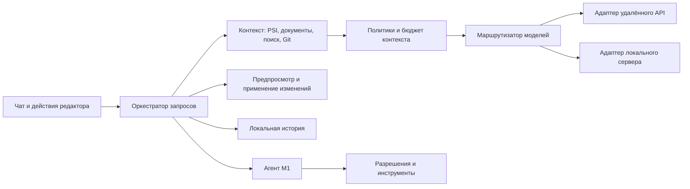

# Техническое задание: AI-ассистент для IntelliJ IDEA

Версия: 0.2. Дата исследования: 16 сентября 2026 года. Проект: `org.agty.aiassistant` / AGTY AI Assistant.

Статус: живое ТЗ и дорожная карта. В репозитории есть рабочая первая реализация чата на Codex CLI; продукт переименован в AGTY AI Assistant, чтобы поддерживать несколько LLM-провайдеров. Следующий целевой провайдер после Codex — Ollama.

## 1. Назначение и основание

Разработать независимый плагин, который помогает понимать проект, генерировать и изменять код, писать тесты и выполнять задачи разработки из интерфейса IDE. Пользователь должен видеть передаваемый контекст, управлять расходами и проверять изменения перед применением.

Функциональный ориентир — JetBrains AI Assistant. Найдены официальная [матрица возможностей](https://www.jetbrains.com/help/ai-assistant/feature-set.html) и [пользовательская документация 2026.2](https://www.jetbrains.com/help/ai-assistant/about-ai-assistant.html). Внутренняя инженерная спецификация JetBrains в исследованных источниках не обнаружена. Настоящее ТЗ описывает собственную реализацию на основе публичных возможностей; архитектура JetBrains из них не выводится.

## 2. Платформа и границы продукта

- Подтверждённая платформа: плагин для IntelliJ IDEA.
- Предлагаемая начальная поддержка: Java и Kotlin; русский и английский интерфейс и запросы.
- Целевая ветка первой версии: IntelliJ IDEA 2026.2, локальная установка на Linux, Windows и macOS. Точные сборки IDE и зависимостей фиксируются на этапе E0; совместимость подтверждается проверками.
- Текстовый контекст допускает другие языки, но семантическая поддержка и качество генерации для них не входят в приёмку MVP.
- MVP работает напрямую с выбранным пользователем провайдером либо локальным сервером моделей. Собственный облачный сервис и подписка не требуются.
- Полноценный агент входит в следующий релиз. MVP уже должен включать чат, изменения через diff, тесты, документацию, Git-сообщения и автодополнение.
- Вне начального объёма: обучение собственной модели, аналог Mellum, биллинг SaaS, корпоративный SSO, мобильный клиент, собственная IDE, Remote Development/Split Mode, специализированные SQL/Jupyter-сценарии.
- Собственные название, интерфейсные ресурсы и реализация; нет зависимости от закрытых API или установленного плагина JetBrains AI Assistant.

## 3. Функциональный ориентир и покрытие

M0 — обязательный MVP; M1 — следующий релиз; M2 — развитие. Наличие функции у JetBrains не означает одинаковую доступность во всех IDE, моделях и агентах.

| Возможность в публичной документации | Объём нашего продукта | Этап | Источник |
| --- | --- | --- | --- |
| Чат с контекстом и выбором модели | Потоковый чат, история, ссылки на файлы, ручной и автоматический контекст | M0 | [Chat](https://www.jetbrains.com/help/ai-assistant/chat-mode.html) |
| Генерация, объяснение, рефакторинг, тесты и документация | Действия над выделением и текущим файлом; просмотр изменений | M0 | [Features](https://www.jetbrains.com/help/ai-assistant/feature-set.html) |
| Встроенные подсказки кода | Одно- и многострочные предложения в редакторе | M0 | [Completion](https://www.jetbrains.com/help/ai-assistant/code-completion.html) |
| Предложение следующего изменения | Отдельный механизм перехода к связанному изменению | M2 | [Next edit](https://www.jetbrains.com/help/ai-assistant/next-edit-suggestions.html) |
| Помощь с Git и ревью | Commit message в M0; self-review, PR-описание и конфликты в M1 | M0/M1 | [Features](https://www.jetbrains.com/help/ai-assistant/feature-set.html) |
| Внешние и локальные модели | Настраиваемые подключения и маршрутизация по задачам | M0 | [Custom models](https://www.jetbrains.com/help/ai-assistant/use-custom-models.html) |
| Агенты с инструментами | Планирование, редактирование нескольких файлов, запуск проверок | M1 | [Agents](https://www.jetbrains.com/help/ai-assistant/agents.html) |
| MCP и внешние агенты ACP | Подключение инструментов и отдельных агентных процессов | M1/M2 | [MCP](https://www.jetbrains.com/help/ai-assistant/mcp.html), [ACP](https://www.jetbrains.com/help/ai-assistant/acp.html) |
| Ограничение доступа к проекту и файлам | Собственная обязательная политика исключений | M0 | [Restrictions](https://www.jetbrains.com/help/ai-assistant/disable-ai-assistant.html) |

JetBrains документирует несколько встроенных агентов и различия в поддержке файлов инструкций и `.aiignore`. Следовательно, интеграцию внешнего агента нельзя считать автоматически подчинённой фильтрам IDE. Для нашего продукта это отдельная граница доверия. [Источник](https://www.jetbrains.com/help/ai-assistant/agents.html).

## 4. Пользовательские сценарии

1. **Разобраться в коде:** выделить метод → «Объяснить» → получить ответ с указанием использованных файлов → перейти к исходному фрагменту.
2. **Изменить реализацию:** описать задачу → проверить список контекста → получить diff → принять выбранные изменения → при необходимости отменить.
3. **Добавить тесты:** выбрать класс → определить существующий тестовый фреймворк → сгенерировать тест → проверить diff → запустить через IDE.
4. **Дополнить код:** начать ввод → увидеть предложение → принять полностью или частично либо отклонить.
5. **Подготовить коммит:** выбрать изменения → получить редактируемое сообщение; коммит выполняется обычным действием пользователя.
6. **Выполнить задачу агентом, M1:** получить план → разрешить нужные операции → наблюдать шаги и проверки → просмотреть итоговые изменения и результат тестов.

## 5. Функциональные требования M0

| ID | Требование | Проверяемый результат |
| --- | --- | --- |
| FR-01 | Настройка endpoint, модели и ключа; проверка соединения; отдельные модели для чата и completion | Работают один удалённый и один локальный совместимый сервер из зафиксированной тестовой матрицы; ошибки авторизации объяснены |
| FR-02 | Чат в Tool Window: streaming, Markdown, блоки кода, новый диалог, повтор, остановка, удаление и экспорт | Отмена прекращает обработку запроса; частичный ответ сохраняется с отметкой; экспорт инициируется пользователем |
| FR-03 | Контекст: выделение, актуальный несохранённый документ, файлы, символы, диагностика, выбранный Git diff | До отправки доступны список источников и просмотр собранного контекста; ссылки открывают файл и строку |
| FR-04 | Автоподбор контекста по символам и текстовому поиску с учётом бюджета | Отключается для запроса; исключённые файлы не попадают в запрос; сокращение контекста явно показано |
| FR-05 | Действия «Объяснить», «Найти проблемы», «Предложить исправление», «Рефакторинг», «Сгенерировать код» | Ответ привязан к выделению; изменения применяются только после просмотра и принятия |
| FR-06 | Генерация тестов и Javadoc/KDoc | Учитываются существующие исходники, тесты и зависимости; новые зависимости предлагаются отдельно; нет утверждения об успешном тесте без запуска |
| FR-07 | Inline completion с debounce, отменой устаревших запросов, принятием и отклонением | Предложение соответствует текущей версии документа; Tab принимает, Escape отклоняет; доступно принятие по строке и переназначение клавиш |
| FR-08 | Предпросмотр и применение изменений, включая создание тестового файла | Можно принять/отклонить отдельный файл или фрагмент; конфликт с новой пользовательской правкой блокирует применение; Undo восстанавливает состояние |
| FR-09 | Генерация commit message по выбранному diff | В запросе только выбранные допустимые изменения; сообщение редактируется; действие не выполняет commit/push |
| FR-10 | Библиотека встроенных и пользовательских шаблонов | Шаблон можно изменить, восстановить и применить; переменные подставляются из контролируемого контекста |
| FR-11 | История отдельно по проектам; лимиты и диагностика запросов | Нет смешивания проектов; доступны модель, длительность, токены при наличии; отсутствие usage обозначено, а не заменено нулём |
| FR-12 | Отключение AI для проекта, локальный режим и исключения | Отключение отменяет очередь; локальный режим не обращается к внешнему провайдеру даже при сбое локального |

### 5.1. Контекст и исключения

Учитывать `.gitignore`, `.aiignore`, бинарные файлы, каталоги сборки и явно исключённые пути. `.aiignore` использовать как жёсткое ограничение для всех встроенных путей чтения и отправки, включая ручные вложения и diff. Наличие `.noai` отключает AI для проекта — это намеренно вводимое поведение нашего плагина.

Нормализовать пути и разрешать символические ссылки до проверки принадлежности проекту. Для файлов вне корней проекта требуется отдельное явное добавление области доступа. Проверять ограничения при чтении и непосредственно перед отправкой. При изменении исключений удалять соответствующие фрагменты из кэша и запрещать повторную отправку исторических вложений; уже отправленные данные у провайдера отозвать нельзя.

История содержит происхождение фрагментов. Перед повторной отправкой применяются актуальные фильтры. Секреты в свободном тексте и ответах дополнительно проверяются эвристически; гарантировать обнаружение любого секрета нельзя.

При превышении контекстного окна сначала сокращать автоматически подобранные материалы и старую историю. Выделение и инструкции не обрезать молча. Вычислять бюджет как окно модели минус резерв ответа и служебные инструкции; при неизвестном токенизаторе использовать консервативную оценку с явной пометкой.

### 5.2. Изменения файлов

Изменение хранится как набор операций с исходным хешем текста и версией документа. Перед записью повторно проверить все затронутые документы, права и пути. Конфликт не устранять перезаписью. Изменения несохранённых документов пользователя входят в исходный снимок и сохраняются при отмене AI-правок.

При ошибке применения набора восстановить только сделанные этим набором изменения. Не использовать `git reset --hard`. Для частичного принятия показать зависимости между фрагментами и предложить повторную валидацию. После применения форматировать изменённые участки средствами IDE, не весь проект.

## 6. Требования следующих релизов

| ID | Этап | Требование и критерий |
| --- | --- | --- |
| AG-01 | M1 | Собственный агент с планом, шагами, итогом, лимитами токенов, времени и числа вызовов; достижение лимита переводит задачу в остановленное состояние |
| AG-02 | M1 | Инструменты поиска, чтения, предложения patch, диагностики, запуска выбранных тестов и команд; аргументы валидируются по схеме до исполнения |
| AG-03 | M1 | Режимы «Чтение» и «С подтверждением»; изменение файлов и запуск процессов в последнем требуют разрешения; разрешение связано с точными аргументами и областью |
| AG-04 | M1 | Запуск команд показывает executable, аргументы, cwd, timeout и эффект; вывод ограничен по размеру, отмена завершает управляемое дерево процессов |
| AG-05 | M1 | MCP-клиент: список серверов и инструментов, разрешения, таймаут, отключение; неизвестный инструмент не запускается без подтверждения |
| AG-06 | M1 | Ревью выбранного diff, проекты PR-описаний, предложения разрешения конфликтов; нет автоматической публикации или изменения Git-истории |
| AG-07 | M2 | ACP-клиент для внешних агентов: согласование возможностей, сессии, события, разрешения и остановка; совместимость фиксируется по агенту и версии |
| AG-08 | M2 | Next edit, семантический поиск, вложения изображений, расширение языков и других IDE; каждый модуль имеет отдельную матрицу проверки |

Произвольный локальный процесс и внешний агент способны читать файлы вне встроенного ContextService. Строгий режим ограничений должен запрещать такой запуск без реально изолированной среды. Для M1 допустим контейнер с разрешёнными рабочими каталогами и сетевой политикой либо отключённое исполнение команд в строгом режиме. Не представлять подтверждение команды как файловую изоляцию.

## 7. Интерфейс

- **Tool Window:** список диалогов, режим, модель, сообщения, контекст, поле запроса, отправка/остановка; в M1 — план и журнал инструментов.
- **Редактор:** контекстные действия, inline-подсказки, ненавязчивый индикатор ожидания и стандартный просмотр diff.
- **Настройки:** подключения, модели по задачам, ограничения контекста, completion, история, конфиденциальность и шаблоны.
- Состояния: настройка не завершена, готовность, сбор контекста, ожидание модели, получение ответа, ожидание решения, отмена, ошибка.
- Клавиатурная навигация, масштабирование шрифта, светлая/тёмная тема; комбинации не должны безусловно перехватывать стандартные действия IDE.
- При ошибке показывать понятную причину и действие: исправить ключ, выбрать модель, сократить запрос или повторить. Содержимое ключей и тела служебных ошибок не выводить.

## 8. Предлагаемая архитектура

Kotlin, IntelliJ Platform SDK, Gradle Kotlin DSL и IntelliJ Platform Gradle Plugin 2.x. JetBrains рекомендует Gradle для разработки плагинов. Для целевой платформы 2026.2 документация указывает Java 25; окончательные toolchain и build numbers фиксируются по выбранной сборке, без предположений о совместимости со старыми IDE. [Разработка плагинов](https://plugins.jetbrains.com/docs/intellij/developing-plugins.html), [совместимость и Java](https://plugins.jetbrains.com/docs/intellij/api-changes-list-2026.html).



Предлагаемая организация исходников, пока не созданная:

```text
src/main/java/org/agty/aiassistant/
  ui/          # Tool Window, настройки, редактор
  application/ # сценарии и жизненный цикл запросов
  context/     # PSI, поиск, бюджет и исключения
  providers/   # подключения и потоковые ответы
  changes/     # ChangeSet, diff, применение и отмена
  storage/     # история и настройки
  security/    # политики и разрешения
  agent/       # цикл и инструменты M1
src/main/resources/META-INF/plugin.xml
src/test/      # модульные и платформенные тесты
docs/          # ТЗ, решения и руководства
```

PSI означает структурное представление кода IDE; его использовать для символов и зависимостей, текстовый поиск — как резервный механизм. При индексации IDE функции, требующие индексов, должны корректно деградировать до выделения/текущего файла.

Сетевые запросы и подбор контекста выполнять вне UI-потока, с отменяемыми coroutine scopes, привязанными к жизненному циклу проекта. Доступ к PSI и документам — через разрешённые read/write actions; сетевые ожидания не удерживают блокировки. [Threading Model](https://plugins.jetbrains.com/docs/intellij/threading-model.html).

### 8.1. Контракты и данные

- `ProviderCapabilities`: streaming, tools, completion, контекстное окно, usage; отсутствующая возможность отключает зависимую функцию.
- `ModelRequest`: requestId, sessionId, modelId, сообщения, разрешённый контекст, лимит ответа, timeout.
- `ModelEvent`: textDelta, toolCall, usage, completed, failed; завершение единственное, поздние события отменённого запроса игнорируются.
- `ContextItem`: путь, диапазон, происхождение, хеш содержимого и оценка токенов.
- `ChangeSet`: операции по файлам, исходные версии, diff и состояние review/applied/rejected/conflict.
- `ToolInvocation`, M1: инструмент, аргументы, область разрешения, статус, ограниченный результат и exit code.

Первая реализация адаптера использует явно документированное подмножество OpenAI-compatible HTTP API; «compatible» не считается гарантией всех возможностей. Конкретные endpoints, схемы streaming и ограничения выбранных серверов закрепить контрактными тестами в E0. Нативные API других производителей добавляются отдельными адаптерами.

Повторять безопасные сетевые запросы ограниченно, с задержкой и учётом `Retry-After`; после частичного ответа повтор предлагает пользователь. Вызовы инструментов с побочными эффектами автоматически не повторять. Ошибки сети не переключают провайдера без ведома пользователя.

## 9. Хранение, конфиденциальность и доступ

- API-ключи хранить через PasswordSafe, отдельно от настроек проекта и логов. [SDK: sensitive data](https://plugins.jetbrains.com/docs/intellij/persisting-sensitive-data.html).
- История — в локальном каталоге данных IDE вне репозитория, с версионируемой схемой, атомарной записью и изоляцией проектов. По умолчанию срок хранения 30 дней, доступно отключение и полное удаление истории/кэша.
- Секреты не включать в экспорт; исходный код не писать в диагностические логи. Диагностический пакет создаётся только по действию пользователя с предварительным просмотром.
- Перед первым обращением показывать endpoint и перечень передаваемых категорий данных. Смена endpoint требует повторного решения пользователя о передаче данных.
- Внешние подключения — TLS с проверкой сертификата; HTTP разрешён по умолчанию только для loopback. Поддержать proxy IDE, не отключать проверку TLS глобально.
- Аналитика использования выключена по умолчанию; при включении исключает код, сообщения и пути файлов.
- Содержимое файлов, ответы моделей и MCP-результаты не могут менять политики разрешений. Инструкции из `AGENTS.md` для M1 применяются как настройки поведения внутри разрешённой области, а не как разрешение на операции.
- В локальном режиме модель заранее установлена: плагин не скачивает её автоматически и не делает удалённый fallback. Политика хранения данных удалённым провайдером определяется его условиями, плагин её не гарантирует.

## 10. Нефункциональные требования

Ниже — целевые показатели нашего продукта, а не измеренные характеристики JetBrains. Стенд: 8 логических ядер, 16 ГБ RAM, SSD, проект из 10 000 текстовых файлов / 200 000 строк, прогретые индексы; точная ОС, сборка IDE и оборудование фиксируются в отчёте.

| ID | Показатель | Метод приёмки |
| --- | --- | --- |
| NFR-01 | Реакция UI на отправку/остановку p95 ≤ 100 мс; нет блокировки EDT плагином > 100 мс | 100 операций с профилированием и mock-провайдером |
| NFR-02 | Сбор контекста текущего файла p95 ≤ 300 мс, поиск по проекту ≤ 2 с | По 100 запросов на стенде; длительность модели исключена |
| NFR-03 | Debounce completion 250 мс; накладные расходы после получения ответа p95 ≤ 150 мс | 100 сценариев ввода; удалённое время отдельно |
| NFR-04 | После отмены сетевой запрос освобождается ≤ 1 с; поздний ответ не меняет UI/код | Медленный и зависающий mock-провайдер |
| NFR-05 | Дополнительная heap-память ≤ 300 МБ после стабилизации; нет роста после 20 циклов открытия/закрытия проекта | Сравнение с IDE без плагина, heap snapshots; память сервера модели отдельно |
| NFR-06 | История переживает перезапуск; повреждение записи не блокирует IDE | Прерывание записи и миграция предыдущей схемы |
| NFR-07 | Секреты, исключённые файлы и данные другого проекта не попадают в проверяемые запросы | Контроль HTTP-трафика тестовым сервером и негативные тесты |

Начальные пределы: 256 КиБ на автоматически читаемый файл, 20 фрагментов автоконтекста, один активный completion на редактор. Превышения обрабатывать явно; пользовательские лимиты не должны превышать возможности модели. Время первого токена реального провайдера измерять и публиковать отдельно, без обещания единого SLA для произвольных моделей.

## 11. Проверки и критерии приёмки

Использовать модульные тесты Kotlin/JVM, IntelliJ Platform test framework для интеграции с документами/PSI и mock HTTP/SSE-сервер для сетевых сценариев. Конкретную совместимую версию JUnit и инструменты GUI-тестирования закрепить в E0. Покрытие логики политик, бюджета контекста и применения изменений: не менее 80% ветвей, плюс обязательные негативные сценарии; процент не заменяет проверку поведения.

| Набор | Обязательные проверки |
| --- | --- |
| AT-01: подключение | FR-01, FR-11: удалённая и локальная модель, неверный ключ, 429, 5xx, timeout, отсутствие capabilities |
| AT-02: чат и контекст | FR-02–04: streaming, отмена, переполнение окна, несохранённый документ, индексация, переход по ссылкам |
| AT-03: изменения | FR-05, FR-06, FR-08: генерация, выборочное применение, новый файл, Undo, конкурентная правка, частичный сбой |
| AT-04: completion | FR-07: ввод, смена курсора/файла, устаревший ответ, отмена, частичное принятие, горячие клавиши |
| AT-05: рабочие функции | FR-09–11: выбранный diff, шаблоны, экспорт, удаление, разделение проектов |
| AT-06: политики | FR-12 и раздел 9: `.aiignore`, `.noai`, symlink, path traversal, ключи в логах, локальный режим, смена endpoint |
| AT-07: надёжность | NFR-01–07: профилирование, отключение сети, закрытие проекта во время запроса, восстановление истории |
| AT-08: агент M1 | AG-01–06: отказ в разрешении, лимиты цикла, повтор toolCall, отмена процесса, вредоносные инструкции в файле, ограничения sandbox |

Качество модели оценивать отдельно от детерминированных тестов плагина: фиксированный набор из 30 задач Java/Kotlin (10 объяснений, 10 правок, 10 тестов), версия модели, параметры, контекст и три прогона. Цель MVP: ≥ 80% успешных попыток суммарно и ≥ 70% в каждой категории. Правки и тесты проверяются сборкой и заранее подготовленными проверками; объяснения — рубрикой фактической корректности, полноты и ссылок на код. Эти пороги применяются только к выбранной эталонной модели.

MVP принимается, когда выполнены FR-01–12, NFR-01–07, AT-01–07, достигнут порог качества на эталонной модели, отсутствуют блокирующие дефекты и потеря пользовательских изменений. Локальный сервер обязан пройти функциональные контрактные тесты; качество каждой локальной модели публикуется отдельно. ZIP устанавливается в чистую IDE, Plugin Verifier не сообщает ошибок совместимости на заявленных сборках. [Проверка диапазонов](https://plugins.jetbrains.com/docs/intellij/build-number-ranges.html).

## 12. Этапы и результаты поставки

| Этап | Работы | Условие завершения |
| --- | --- | --- |
| E0: техническая проверка | Выбрать точные IDE/JDK/Gradle, удалённую и локальную модель; проверить API completion, PSI, diff, streaming и отмену | Минимальный устанавливаемый прототип, матрица совместимости и решения по рискам |
| E1: основа M0 | Настройки, адаптеры, политики, чат, история, ручной контекст | Сквозной запрос с проверкой передаваемых данных и отменой |
| E2: функции M0 | Автоконтекст, действия редактора, тесты, документация, diff, Git, completion | Выполнены FR-01–12 на тестовом проекте |
| E3: выпуск M0 | Производительность, негативные тесты, качество модели, упаковка и руководства | Выполнены критерии MVP из раздела 11 |
| E4: M1 | Агент, инструменты, разрешения, MCP и расширение Git-функций | Выполнены AG-01–06 и AT-08 |
| E5: M2 | ACP, next edit, дополнительные языки и IDE | Отдельные критерии совместимости и качества по каждой функции |

Поставка: исходный код, Gradle Wrapper с закреплёнными зависимостями, ZIP плагина, README с настройкой и командами, руководство пользователя, описание архитектуры, тестовые проекты и отчёты, журнал изменений. CI должен собирать, тестировать и проверять совместимость без пользовательских API-ключей; реальные провайдеры проверяются отдельным защищённым прогоном.

Планируемые команды после создания проекта: `./gradlew test`, `./gradlew runIde`, `./gradlew buildPlugin`, `./gradlew verifyPlugin`. Сейчас сборочных файлов нет, эти команды ещё не доступны. Сроки и стоимость оцениваются после E0 по выбранным моделям, составу команды и результатам проверки API.

## 13. Решения, уточняемые перед реализацией

1. Выбрать точные сборки IntelliJ IDEA для первой поставки; расширение на другие IDE не входит в подтверждённый начальный объём.
2. Выбрать обязательные провайдеры, эталонные модели, инфраструктуру локального запуска и допустимые расходы.
3. Подтвердить Java/Kotlin и границу между M0 и агентным M1.
4. Уточнить ограничения на отправку кода, срок хранения истории и необходимость полностью изолированного режима.
5. Определить канал распространения, окончательное название, лицензию проекта и потребность в командном администрировании.

Отсутствие этих решений не мешает использовать документ как основу декомпозиции; до их подтверждения нельзя считать допущения договорными обязательствами или заявлять полный паритет с JetBrains AI Assistant.
